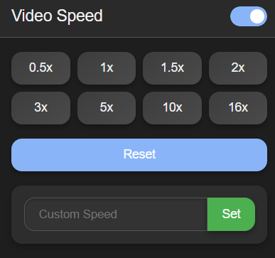

# 🎬 Video Speed Controller

> Supercharge your video watching experience with precise speed control up to 16x

## ✨ Features

- **Flexible Speed Control** - From 0.5x to 16x playback speeds
- **Universal Compatibility** - Works with YouTube, Netflix and most other video platforms
- **Elegant UI** - Clean, intuitive interface with light & dark themes
- **Instant Feedback** - Visual notification when speed changes

## 🚀 Installation

1. Clone this repository
2. Open Chrome and navigate to `chrome://extensions/`
3. Enable "Developer mode" in the top right corner
4. Click "Load unpacked" and select the extension folder

## 🔧 How to Use

1. **Navigate to any webpage with video content**
2. **Click the extension icon** in your browser toolbar
3. **Select desired speed** from the preset options or enter a custom value
4. **Enjoy your video** at the perfect speed

### Controls
- Speed Presets - Quick access to common speeds (0.5x to 16x)
- Custom Speed - Enter any precise value
- Reset Button - Return to normal 1x speed instantly

---

Made with ❤️ for video watchers everywhere